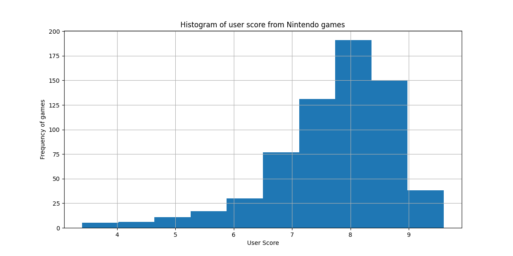

# Machine Learning

Welcome to the Machine Learning project! This project focuses on training machine learning models using the Nintendo games database.

We have utilized three different machine learning algorithms in this project: **K-Nearest Neighbors**, **Naive Bayes**, and **Neural Network**. Below are the accuracy, precision, and recall scores achieved by each algorithm:

| Metric    | K-Nearest Neighbors | Naive Bayes | Neural Network |
| --------- | ------------------- | ----------- | -------------- |
| Accuracy  | 68.94%              | 100.00%     | 82.58%         |
| Precision | 74.31%              | 100.00%     | 92.77%         |
| Recall    | 86.17%              | 100.00%     | 81.91%         |

These scores demonstrate the performance of each algorithm in predicting user preferences for Nintendo games. Additionally, the Naive Bayes algorithm achieved perfect accuracy, precision, and recall, indicating its effectiveness in this context.

## Dataset

The dataset contains the following columns:

- `meta_score`: The Metacritic score of the game.
- `title`: The title of the game.
- `platform`: The platform on which the game is released.
- `date`: The release date of the game.
- `user_score`: The user score of the game.
- `link`: Link to the game.
- `esrb_rating`: ESRB rating of the game.
- `developers`: Developers of the game.
- `genres`: Genres of the game.
- `best_game`: Binary indicator (1 or 0) denoting whether the game is considered one of the best according to the criteria (Meta Score >= 70 and User Score >= 7.0).

* The `best_game `column is added during the preprocessing of the dataset to identify games that meet the specified criteria for being classified as one of the best.

## Usage

1. Clone the repository:

   ```bash
   git clone https://github.com/JonasDias10/machine-learning.git
   ```

2. Navigate to the project directory:

   ```bash
   cd machine-learning
   ```

3. Install the required dependencies:

   ```bash
   pip install -r requirements.txt
   ```

4. Run the Python scripts:

   - `main.py`: Script for preprocessing data and training models.

5. After executing the script, a file containing the result will be saved in the `outputs/` directory.

## Note

- Ensure that you have Python installed on your system along with the required libraries mentioned in `requirements.txt`.
- This project is for educational and experimental purposes only. The models trained here may not be suitable for production use without further refinement and validation.

## Results and Insights About Database

### Meta Score Distribution


### User Score Distribution



## Confusion Matrices

Below are the confusion matrices for each of the machine learning models trained on the Nintendo games database:

### K-Nearest Neighbors Confusion Matrix


The confusion matrix for K-Nearest Neighbors (KNN) model shows the following performance metrics:

- **Accuracy**: 68.94%
  - This indicates that KNN correctly classified approximately 68.94% of all games in the dataset.
- **Precision**: 74.31%
  - KNN achieved a precision of 74.31%, meaning that when it predicted a game to be one of the best, it was correct 74.31% of the time.
- **Recall**: 86.17%
  - The recall score of 86.17% suggests that KNN was able to correctly identify 86.17% of the actual best games in the dataset.

### Naive Bayes Confusion Matrix


The confusion matrix for the Naive Bayes model demonstrates the following performance metrics:

- **Accuracy**: 100.00%
  - Naive Bayes achieved perfect accuracy, correctly classifying all games in the dataset.
- **Precision**: 100.00%
  - With a precision score of 100.00%, Naive Bayes made no false positive predictions.
- **Recall**: 100.00%
  - Naive Bayes also achieved perfect recall, correctly identifying all actual best games in the dataset.

### Neural Network Confusion Matrix


The confusion matrix for the Neural Network model indicates the following performance metrics:

- **Accuracy**: 82.58%
  - Neural Network achieved an accuracy of 82.58%, correctly classifying approximately 82.58% of all games in the dataset.
- **Precision**: 92.77%
  - The precision score of 92.77% suggests that when Neural Network predicted a game to be one of the best, it was correct 92.77% of the time.
- **Recall**: 81.91%
  - The recall score of 81.91% indicates that Neural Network was able to correctly identify 81.91% of the actual best games in the dataset.

These insights help evaluate the performance of each machine learning model in predicting the best Nintendo games based on the provided criteria.

---

**Author: Jonas Dias | [Social Media](https://jonas-dias.netlify.app/) | Thank You**
